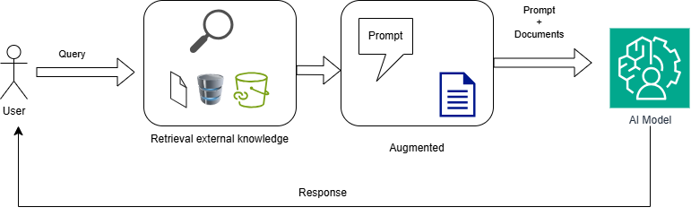

# Retrieval-Augmented Generation (RAG)

- [Retrieval-Augmented Generation (RAG)](#retrieval-augmented-generation-rag)
  - [Purpose](#purpose)
  - [What is RAG?](#what-is-rag)
  - [Why to use RAG?](#why-to-use-rag)
  - [RAG vs Fine-Tuning](#rag-vs-fine-tuning)
    - [RAG use cases](#rag-use-cases)
    - [Fine-Tuning use cases](#fine-tuning-use-cases)
  - [What It means?](#what-it-means)
  - [How Does It work?](#how-does-it-work)
    - [Data Ingestions](#data-ingestions)
    - [Retrieval process](#retrieval-process)
      - [Semantic Search](#semantic-search)
      - [Criteria for ranking data](#criteria-for-ranking-data)
    - [Generation](#generation)
  - [Most popular Vector Databases](#most-popular-vector-databases)
  - [References:](#references)
  

## Purpose

The purpose of this repo is to guide people who are getting into the world of RAG technology and AI.

## What is RAG?

RAG is a technique that integrates the AI Model with external data in order to enhance the result without the need to re-train the model.
The process consist of retrieving data from an external store, such as a vector database, to include in the prompt or context to be processed by the AI Model.

Retrieval:  Fetch data from external knowledge base.
Augmented:  Includes the data previously fetched into the query/prompt.
Generation: The AI Model process the query/prompt and the data from the external knowledge base in order to generate a response.

## Why to use RAG?

RAG technology is designed to address the limitations of AI models (both small and large language models), such as:
- Pre-trained or static data: AI Model are trained with static data which became outdated.
- Size of AI Model: the use of RAG allows the selection of small size Language Model due to the capability of providing up-to-date data.
- Domain-Specific customization: RAG technology is usefull for retrieving data about specific domains without need to re-train a model.
- Combines context data with up-to-date information.

## RAG vs Fine-Tuning

Both techniques are popular for adapting AI models to specific needs. The key difference lies in how they obtain data. While fine-tuning relies on static training using parameters, Retrieval-Augmented Generation (RAG) can access dynamic data using real-time methods.

### RAG use cases
- Customer Support Chatbots: Fetching and generating answers from a dynamic knowledge base of FAQs, product manuals, or troubleshooting guides.
- Open-Domain Question Answering: Providing answers to questions by retrieving relevant documents from a large corpus, such as research papers or news articles.
- Personalized Learning Assistants: Helping students by retrieving contextually relevant educational materials from a database in real time.

### Fine-Tuning use cases
- Legal Document Analysis: Training a language model on legal texts to specialize in summarizing, classifying, or extracting clauses from contracts or legal documents.
- Sentiment Analysis in Social Media: Fine-tuning a model on labeled social media posts to classify sentiments (positive, negative, neutral) for specific industries or campaigns.
- Medical Diagnosis Support: Training on a dataset of medical records or diagnoses to assist healthcare professionals in identifying conditions or generating patient-specific reports.

## How Does It work?

### Data Ingestions

The process of ingestion consist of:
- Collect the data from the documents, websites, and so on.
- Clean the information by remmoving unnecesary data.
- Separate the data into chunks. 
- Embedding model transform the data into numerical vector, encoding the semantic means of the text.
- The embedded data is loaded into a database, usually a Vector Database.
- Index the embedding data.

### Vector embeddings

Vector embeddings are numerical representations of data objects—such as words, phrases, and sentences—expressed as vectors that encapsulate their semantic meaning. These embeddings are created using AI models designed for this purpose. They play a critical role in RAG technology, enabling efficient and precise retrieval of relevant information.

Example:

Original Text:
"The sky is blue."

Vector Embedding:
- "The"  → [0.12, 0.45, -0.23, 0.67, 0.05]
- "sky"  → [0.78, 0.11, -0.44, 0.56, 0.33] 
- "is"   → [0.34, -0.12, 0.89, 0.01, 0.41] 
- "blue" → [0.90, 0.22, -0.55, 0.33, 0.77]

### Popular Embedding Model

| **Model Name**                     | **Description**                                                                 | **Use Cases**                                                                 |
|------------------------------------|---------------------------------------------------------------------------------|-------------------------------------------------------------------------------|
| **text-embedding-ada-002**         | OpenAI's embedding model optimized for semantic search, RAG, and clustering.    | Document retrieval, question answering, similarity analysis.                  |
| **BGE (BAAI General Embedding)**   | High-performance embeddings by BAAI, supporting multilingual and long-context. | Cross-lingual semantic search, enterprise RAG, dense retrieval systems.       |
| **E5 (EmbEddings from bidirEctional Encoders)** | Microsoft's text embeddings trained with contrastive learning.               | Hybrid search, multilingual retrieval, knowledge-intensive NLP tasks.         |
| **GTR (General T5 Retrieval)**     | Google's T5-based model fine-tuned for retrieval tasks.                        | Large-scale document retrieval, QA systems, academic research.                |
| **Cohere Embed**                   | Cohere's dense retrieval model optimized for semantic accuracy.                | Enterprise search, contextual recommendation, multilingual RAG pipelines.     |
| **all-mpnet-base-v2**              | Sentence Transformer model with MPNet architecture for sentence embeddings.   | Semantic similarity, clustering, legal/medical document analysis.            |
| **multi-qa-mpnet-base-dot-v1**     | Sentence Transformer fine-tuned for multi-question answering retrieval.        | FAQ matching, customer support automation, e-commerce product search.        |
| **Universal Sentence Encoder (USE)** | Google's model for sentence-level embeddings via Transformer or DAN encoder.  | Sentiment analysis, chatbot intent matching, content recommendation.          |
| **INSTRUCTOR**                     | Instruction-tuned embeddings for task-aware semantic representations.          | Task-specific search (e.g., "find research papers"), dynamic RAG workflows.   |
| **Jina Embeddings v2**             | Open-source model optimized for long document retrieval and RAG.               | Academic research, financial report analysis, patent search.                 |

### Retrieval process

The retrieval phase is the process of searching and identifyig relevant information in the database. 

The steps executed by the retrieval are:
- Semantic search: Interpret and understand the input query from the user in order to use It as input for generating a query to a database and/or external knowledge database.
- Retrieval: The query is used for retrival of information.
- Ranking: The information is ranked based on the query.
- Selection: The top-ranked information is selected.
- Context generation: Within the selected information, the process generate context using the most relevant data, which is included in the input to the AI Model.

#### Semantic Search

This approach is designed for performing searches in vector databases by leveraging embeddings generated by AI models. These models transform text into numerical vector representations, which are then used to query the vector database. 

The most common technique for searching within a vector database is Approximate Nearest Neighbor (ANN). This algorithm may not always return the exact nearest neighbor but typically delivers sufficiently accurate results for most use cases. It prioritizes performance over accuracy.

### Why Use ANN?

In high-dimensional spaces, exact nearest neighbor search becomes computationally expensive due to the "curse of dimensionality," where the cost of distance computations grows exponentially with the number of dimensions. ANN methods significantly reduce the computational burden by approximating the search results, often achieving orders of magnitude speedups with minimal loss in accuracy.
  
#### Criteria for ranking data

- Relevance to the query
- Context of the conversation
- Up-to-date data. In some cases, the process might prioritize how recent is the data
- Reliability of the data. The system might consider the reliability of the source
- Conversation history

### Generation 

The generation step consist of sending the contextual data created in the retrieval process in combination with the user's input message to the AI Model, which generates the final response.

### Most popular Vector Databases

Below there is a list of the most popular databases used for RAG:
| Database Name | 
URL
 | 
Description
 |
|---|---|---|
| **Pinecone** | [https://www.pinecone.io/](https://www.pinecone.io/) | A fully managed vector database designed for high-performance similarity search, ideal for real-time applications. |
| **Weaviate** | [https://weaviate.io/](https://weaviate.io/) | A cloud-native, real-time vector search engine with GraphQL and RESTful APIs, supporting hybrid search. |
| **ChromaDB** | [https://www.trychroma.com/](https://www.trychroma.com/) | An open-source embedding database that's easy to use and deploy, suitable for development and smaller applications. |
| **FAISS (Facebook AI Similarity Search)** | [https://faiss.ai/](https://faiss.ai/) | A library for efficient similarity search and clustering of dense vectors, highly optimized for performance. |
| **Milvus** | [https://milvus.io/](https://milvus.io/) | An open-source vector database built for large-scale vector similarity search, supporting various indexing and query types. |
| **Qdrant** | [https://qdrant.tech/](https://qdrant.tech/) | A vector similarity search engine and database, providing a scalable and production-ready solution for vector search. |
| **Vespa** | [https://vespa.ai/](https://vespa.ai/) | An open-source big data serving engine that also excels at vector search, supporting hybrid search and complex queries. |
| **MongoDB Atlas Vector Search** | [https://www.mongodb.com/products/platform/atlas-vector-search](https://www.mongodb.com/products/platform/atlas-vector-search) | Integrates vector search capabilities within MongoDB Atlas, allowing for unified data management and querying. |
| **Supabase vector** | [https://supabase.com/docs/guides/database/extensions/vectors](https://supabase.com/docs/guides/database/extensions/vectors) | Postgres extensions that enable vector storage and searching, integrated directly into the Supabase platform. |
| **Redis Vector** | [https://redis.com/docs/stack/search/reference/vectors/](https://redis.com/docs/stack/search/reference/vectors/) | Redis extends its data structures to include vectors, allowing for fast vector similarity searches alongside traditional Redis operations. |

## References:

- https://huggingface.co/docs/transformers/model_doc/rag
- [Retrieval-Augmented Generation for Knowledge-Intensive NLP Tasks](https://arxiv.org/abs/2005.11401)
- [what is vector embedding?](https://www.ibm.com/think/topics/vector-embedding)
- [Mistral Embeddings](https://docs.mistral.ai/capabilities/embeddings/)
- [Ollama Embeddings](https://ollama.com/blog/embedding-models)
